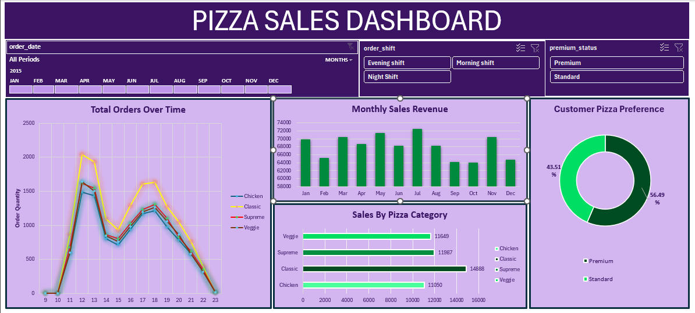

# Pizza Sales Analysis Dashboard (Excel)

This project focuses on analyzing pizza sales data to uncover valuable business insights. The goal was to clean, process, and analyze raw sales data, and finally present the results in a professional Excel dashboard.

## Project Structure

- **Raw_Dataset.xlsx** → Original dataset (as received)

- **Cleaned_Dataset.xlsx** → Processed dataset after data cleaning

- **Pizza_Sales_Dashboard.xlsx** → Interactive Excel dashboard

- **Dashboard_Snapshot.png** → Image preview of the dashboard

## 🔄 Workflow & Process

## **1. Data Cleaning**

- Removed duplicate records and empty rows

- Corrected inconsistent pizza names, sizes, and categories

- Fixed formatting issues (date, time, currency)

- Standardized column headers for clarity

- Ensured data integrity for further analysis

## **2. Data Transformation**

- Added new calculated columns (e.g., revenue = quantity × price)

- Converted order_time into time periods (Morning, Afternoon, Evening, Night) for better analysis

- Grouped sales by month and day of week

## **3. Exploratory Data Analysis (EDA) with Pivot Tables**

- Monthly Revenue Trends → How sales changed over different months

- Category-wise Performance → Which pizza categories sell the most

- Top Pizzas by Revenue & Quantity → Identifying best sellers

- Sales by Size → Which pizza sizes contribute the most revenue

- Time of Day Analysis → When customers buy the most pizzas

## **4. Dashboard Creation**

- Combined pivot tables into interactive charts (bar, line, pie, donut)

- Applied slicers/filters to allow quick analysis

- Designed a professional dashboard with clear KPIs and charts
  

## **📊 Key Insights from the Dashboard**

- **Sales Trend:** Revenue peaks during weekends and evenings

- **Best Category:** Classic & Supreme pizzas generate the highest sales

- **Top Seller:** A few specific pizzas consistently lead in both revenue and orders

- **Customer Behavior:** Most orders occur in the Evening shift

- **Pizza Size Impact:** Large and Extra-Large pizzas bring higher revenue compared to small ones

## **🚀 Tools & Techniques Used**

- Microsoft Excel

- Data Cleaning (Remove duplicates, formatting, transformations)

- Pivot Tables & Pivot Charts

- Dashboard design (with slicers and KPIs)

## **📌 Learning Outcomes**

Through this project, I improved my skills in:

- Data Cleaning & Preparation

- Business Data Analysis with Excel

- Dashboard Designing & Storytelling

- Extracting business insights from raw sales data
